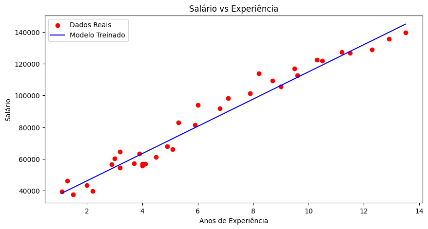
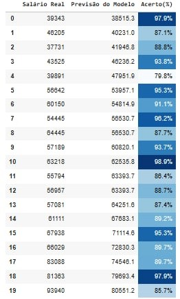

# 📈 Primeiro Projeto: Previsão Salarial com Regressão Linear

## 📝 Description
Este é o meu primeiro projeto de Ciência de Dados! O objetivo principal foi criar um modelo de **Regressão Linear** capaz de prever salários com base nos anos de experiência de um profissional. Além da modelagem, o projeto foca na automação da análise de performance e na apresentação visual dos dados.

## 🚀 Key Features
* **Machine Learning:** Implementação de Regressão Linear Simples com `scikit-learn`.
* **Data Slicing:** Separação dinâmica de atributos e alvos utilizando `.iloc`.
* **Advanced Styling:** Estilização de tabelas com `Pandas Styler`, aplicando gradientes de cores para facilitar a leitura da acurácia do modelo.
* **Visualization:** Gráfico de dispersão com linha de tendência utilizando `Matplotlib`.

## 🛠️ Technologies
* **Python 3**
* **Pandas** 
* **Scikit-Learn:** Criação, treino e teste do modelo preditivo.
* **Matplotlib:** Geração de gráficos para análise visual.

## 📊 Visual Results

### Model Regression Line
O gráfico demonstra a relação entre a experiência e o salário, com a linha azul representando a previsão do modelo sobre os dados reais (pontos vermelhos).

### Performance Table
*Nota: Como o GitHub não renderiza cores de tabelas Pandas diretamente no código, a tabela abaixo demonstra como os dados são apresentados no ambiente de desenvolvimento:*

## 📈 Model Performance
O modelo foi avaliado comparando o **Salário Real** vs **Previsão do Modelo**. Criei uma coluna de **Acerto (%)** que automatiza a percepção de erro, onde tons mais escuros de azul indicam uma precisão próxima a 100%.

---
**Desenvolvido por Igor Vinicius** *Estudante de Ciência de Dados focado em transformar dados em decisões.*
